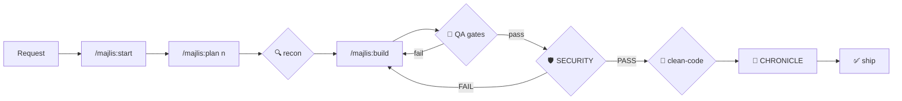

<div align="center">

# 🏛️ MAJLIS · The Council — المجلس

### **40 real agents · 90+ skills · 6 governing commands · 30+ platforms · one command**

**One mind. Every tool.** — عقلٌ واحد في كل أدواتك

`npx majlis-council --all`

[Installation](#-installation) · [The Council](#-the-council-of-forty) · [Commands](#-six-governing-commands) · [Pipeline](#-the-pipeline) · [Security Gate](#-the-red-gate) · [Docs AR](USAGE_AR.md) / [EN](USAGE_EN.md) / [ZH](USAGE_ZH.md)

</div>

---

## What Majlis is

Majlis is **not an editor and not a model**. It is a *discipline layer* that installs on top of the AI coding tool you already use (OpenCode, Claude Code, Codex, Gemini CLI, Cursor, Copilot…). After one command you get, inside that tool:

- **40 real subagents** with fixed roles and least-privilege permission matrices
- **90+ curated skills** deployed in the universal `SKILL.md` standard
- A **governing lifecycle** (6 commands) that refuses to ship code without runnable test evidence and a passed security gate
- An append-only audit trail (`CHRONICLE.md`) plus distilled lessons (`LESSONS.md`)
- A **self-healing updater**: bump `VERSION.txt` → next launch silently redeploys everything everywhere

Everything is plain Markdown + a tiny installer. No runtime lock-in, no daemon, no account.

---

## 📦 Installation

| Goal | Command |
|---|---|
| Everything (recommended) | `npx majlis-council --all` |
| Only one platform | `npx majlis-council --claude` · `--codex` · `--opencode` · `--gemini` · `--universal` |
| Add rule-pointers to one project | `npx majlis-council --scaffold C:\path\to\project` |
| From source on Windows | `powershell -File install_system.ps1` |

> `--universal` deploys to `~/.agents/skills` (agentskills.io) which GitHub Copilot, Kilo, Aider and ~26 more tools read natively.

## 🏛️ The Council of Forty

Every member below is a **real subagent file** with its own frontmatter, permissions and playbook skill. Verified by automated audit: `709 checks · 0 failures`.

### Command & Strategy
| Agent | Role |
|---|---|
| 🧠 `@hadi-core` | Supreme brain — arbitration, final strategic calls |
| 🎼 `@hadi-maestro` | Orchestrator — decomposes work, routes every step |
| 🧭 `@product-shaper` | Turns ideas into PRDs, user stories, acceptance criteria |

### Reconnaissance & Risk
| Agent | Role |
|---|---|
| 🔍 `@rased-explorer` | 360° codebase recon before any change |
| 🕵️‍♂️ `@risk-assessor` | Feasibility studies; prices risk before it is paid |
| 🔎 `@incident-detective` | Blameless root-cause analysis when things break |

### Engineering
| Agent | Role |
|---|---|
| ⚙️ `@emad-api-shield` | Backend/API build & hardening (authn/z, validation, rate limits) |
| 🗄️ `@data-modeler` | Schemas, ERDs, normalized relations |
| 📐 `@integrative-architect` | Integration blueprints & contracts |
| 🔀 `@stream-partitioner` | Memory-safe chunking of huge payloads |
| 📦 `@dep-manager` | Dependency audits, pruning, pinning |
| 🔄 `@cicd-automator` | Pipelines that fail loudly and ship safely |
| 🧪 `@sandbox-isolator` | Isolated execution for risky experiments |
| 💻 `@motion-coder` | Remotion/FFmpeg video assembly at 60FPS |

### Quality & Security (the gates)
| Agent | Role |
|---|---|
| 🛡️ `@sareem-security` | **Red gate**: secrets → config exposure → API defenses → PASS/FAIL |
| 🎯 `@baher-qa` | Evidence-only QA: lint → typecheck → tests |
| 🧼 `@nadif-clean-code` | Final clean-code review, anti-sycophancy rubric |
| ✨ `@code-polisher` | 4-pass behavior-preserving polish after review |
| ⚗️ `@test-engineer` | Unit/integration/e2e suites in your existing framework |
| ⚡ `@perf-auditor` | Profiling & load discipline (p50/p95/p99), k6-based |
| ♿ `@a11y-auditor` | WCAG 2.2 AA compliance reviews |

### Experience & Identity
| Agent | Role |
|---|---|
| 📈 `@bayan-diagrams` | Mermaid architecture/ERD/sequence visualizations |
| 🖌️ `@design-system-master` | Tokens, palettes, Shadcn/HSL identity |
| 📱 `@responsive-layout` | Multi-device layout correctness |
| 🔬 `@ux-researcher` | Usability heuristics & journey evidence |
| 👑 `@brand-guardian` | Voice/tone/identity consistency |
| 🖨️ `@print-publisher` | Press-perfect vector PDFs (300DPI) |
| 🚀 `@growth-analyst` | Funnels, experiments, tracking wiring |

### Knowledge & Operations
| Agent | Role |
|---|---|
| 📝 `@sajeel-logger` | Append-only timestamped chronicle |
| 🧠 `@hakim-mentor` | Retrospectives → LESSONS.md |
| 📣 `@balegh-docs` | Bilingual EN/AR docs & release notes from real diffs |
| 🧰 `@mubtakir-tools` | Search → evaluate → wire external tools/skills |
| 🐣 `@agent-weaver` | Creates new subagents & skills safely |
| 🪄 `@prompt-smith` | Forges/refines prompts & playbooks |
| 📚 `@context-steward` | Compressed indexes & token budgets |
| 🗂️ `@portfolio-steward` | Cross-project health dashboard |
| 🎙️ `@voice-engineer` | TTS/narration pipelines |
| 📊 `@data-engineer` | Routes the ~40 science-database skills |

## 🕹️ Six Governing Commands

Deployed natively per platform: OpenCode `/majlis-start` · Claude `/majlis-start` · Codex `/prompts:majlis-start` · Gemini `/majlis:start` · elsewhere just say *"run majlis start"*.

| Command | Does | Enforced gate |
|---|---|---|
| `/majlis:start` | Guided init → `.majlis/PROJECT.md` `ROADMAP.md` `STATE.md` | — |
| `/majlis:plan <n>` | Wave decomposition; every task carries a runnable `verify:` contract | plan without verification = **rejected** |
| `/majlis:build` | Parallel wave execution via proper agents; atomic commit per wave | forbidden globs respected; verify must pass |
| `/majlis:review` | Panel of 2–4 reviewers, non-overlapping rubrics, anti-sycophancy clauses | BLOCKER bounces back (max 3 cycles) |
| `/majlis:security` | TruffleHog → Nuclei → OWASP ZAP → manual audit | `SECURITY: PASS` mandatory to proceed |
| `/majlis:status` | Dashboard + routes to exact next action | read-only |

## 🔄 The Pipeline



## 🌐 Platform Coverage

| Tier | Platforms | What you get |
|---|---|---|
| Native agents | OpenCode, Claude Code | 40 subagents + 6 slash commands + skills auto-discovery |
| Prompt-native | Codex CLI, Gemini CLI | `$skills`, `/prompts:majlis-*`, `/majlis:*` |
| Rules + universal | Cursor, Windsurf, Copilot, Antigravity, Kilo, Aider, +26 | rule pointers + `~/.agents/skills` standard |

## 🔁 Self-Healing Updates

1. Edit anything in the package.
2. Bump `VERSION.txt`.
3. Next OpenCode launch: the bundled plugin detects drift and redeploys **all platforms in ~0.5s**, silently. Corrupted installs repair themselves. Log: `~/.config/opencode/.majlis_bootstrap.log`.

## 📤 Publishing your own copy

This repo ships an npm-ready bundle in [`npm/`](npm):

```bash
cd npm
# set your scope/name in package.json once
npm publish        # users then run: npx majlis-council --all
```

## ✅ Integrity

Automated reality-check across source + 4 deploy targets:
**709 assertions passing — 0 failures** (agents parity, skill validity/descriptions/deployment, command presence, landing-page references).

## 📚 Full guides

- العربية — [USAGE_AR.md](USAGE_AR.md)
- English — [USAGE_EN.md](USAGE_EN.md)
- 中文 — [USAGE_ZH.md](USAGE_ZH.md)
- Constitution — [AGENTS.md](AGENTS.md)

---

<div align="center">

**MIT License** · *Hunt first. Ship clean.* · يصطاد أولاً، يسلّم نقيّاً

</div>
