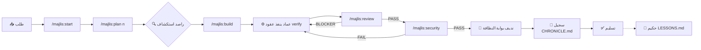

# 🏛️ المجلس — MAJLIS · The Council
### دليل الاستخدام الكامل | الإصدار 9.0

> **«عقلٌ واحد… في كل أدواتك»**
> نظام فيلق وكلاء منضبط: 40 وكيلاً متخصصاً حقيقيين + أكثر من 90 مهارة، يُركَّب بأمر واحد فوق أي محرر ذكاء اصطناعي، مع خط إنتاج إلزامي: تخطيط ← تنفيذ ← اختبارات ← بوابة أمنية ← توثيق — ويتحدّث نفسه ذاتياً عند كل إصدار.

---

## 1) ما هذا بالضبط؟
المجلس **ليس** محرر أكواد ولا بديلاً عن Claude Code أو OpenCode. هو **طبقة انضباط وفريق عمل** تركبها *فوق* الأداة التي تحبها، فتحصل في أي أداة على:
- فريق وكلاء بأدوار ثابتة وصلاحيات مضبوطة
- دورة عمل حاكمة لا تسمح بتسليم كود بدون إثبات اختبار وبوابة أمنية
- ذاكرة مؤسسية موثّقة (`CHRONICLE.md`) ودروس مستخلصة (`LESSONS.md`)

## 2) التثبيت

| الطريقة | الأمر |
|---|---|
| **عبر npm (موصى بها)** | `npx majlis-council --all` |
| اختيار منصة واحدة | `npx majlis-council --claude` (أو `--codex` / `--opencode` / `--gemini` / `--universal`) |
| سقالة مشروع محدد | `npx majlis-council --scaffold C:\path\project` |
| من الحزمة مباشرة (Windows) | `powershell -File install_system.ps1` |

بعد التثبيت افتح أي جلسة في أداتك — الوكلاء والأوامر والمهارات كلها جاهزة.

## 3) مجلس الأربعين

| استدعاء | الوكيل | وظيفته | صلاحياته |
|----------|--------|--------|-----------|
| `@hadi-maestro` | 🎼 مايسترو هادي | التخطيط الاستراتيجي وتوزيع المهام | قراءة + git |
| `@rased-explorer` | 🔍 راصد | استكشاف الكود 360° قبل أي عمل | قراءة فقط |
| `@emad-api-shield` | ⚙️ عماد | بناء وتحصين الخلفية وواجهات API | كاملة |
| `@baher-qa` | 🎯 باهر | بوابات الجودة: lint ← typecheck ← tests | تنفيذ دون تعديل |
| `@sareem-security` | 🛡️ صارم | البوابة الحمراء: أسرار/ثغرات/حكم PASS-Fail | تنفيذ دون تعديل |
| `@nadif-clean-code` | 🧼 ندیف | بوابة الكود النظيف النهائية (قواعد مضادة للتملق) | قراءة + git |
| `@bayan-diagrams` | 📈 بَيَان | مخططات Mermaid للمعمارية والتدفقات | كتابة مخططات |
| `@sajeel-logger` | 📝 سجيل | التوثيق الزمني في CHRONICLE.md | إلحاق فقط |
| `@hakim-mentor` | 🧠 حكيم | الدروس المستفادة في LESSONS.md | تعديل محدود |
| `@mubtakir-tools` | 🧰 مبتكر | بحث وتقييم وتركيب الأدوات والمهارات | كاملة |
| `@balegh-docs` | 📣 بَليغ | التوثيق الثنائي EN/AR وملاحظات الإصدار | تعديل ملفات التوثيق |

> على المنصات بدون نظام وكلاء فرعيين (Codex/Cursor/Gemini…) تتوفر الأدوار كأوامر `/prompts:majlis-*` أو تُتقمَّص حسب جدول الدليل الرئيسي.


> **✦ التوسعة (v9.2):** بعد دراسة المنافس أُضيف 13 متخصصاً جديداً (`@product-shaper` `@ux-researcher` `@brand-guardian` `@growth-analyst` `@code-polisher` `@test-engineer` `@perf-auditor` `@a11y-auditor` `@release-manager` `@incident-detective` `@prompt-smith` `@context-steward` `@portfolio-steward`) — والمجلس الآن **40/40** حقيقياً.  
> **✦ المجلس الموسّع (v9.1):** أصبح الأربعة والعشرون الباقون وكيلاً حقيقياً أيضاً — المجلس الآن **27/27** قابلاً للاستدعاء في كل المنصات: `@agent-weaver` · `@data-modeler` · `@stream-partitioner` · `@integrative-architect` · `@risk-assessor` · `@cinematic-director` · `@design-system-master` · `@responsive-layout` · `@print-publisher` · `@motion-coder` · `@cicd-automator` · `@sandbox-isolator` · `@dep-manager` · `@voice-engineer` · `@data-engineer` · `@hadi-core`


📖 **التفاصيل الكاملة:** [COUNCIL.md](COUNCIL.md) — الأربعون وكيلاً بالفرق | [SKILLS_CATALOG.md](SKILLS_CATALOG.md) — كل مهارة بوصفها

## 4) الأوامر الست — دورة الحياة

```
/majlis:start      ← بدء مشروع: أسئلة موجّهة ثم PROJECT + ROADMAP + STATE
/majlis:plan <n>   ← تفكيك المرحلة إلى موجات مهام بعقود تحقق إلزامية
/majlis:build      ← تنفيذ الموجات بالتوازي عبر الوكلاء المناسبين
/majlis:review     ← لجنة مراجعة 2-4 مراجعين بقواعد مضادة للتملق (3 دورات كحد أقصى)
/majlis:security   ← البوابة الحمراء: أسرار ← تكوينات ← دفاعات API ← حكم نهائي
/majlis:status     ← لوحة تقدم + توجيه للخطوة التالية بالضبط
```

**صيغ الأوامر حسب المنصة:**

| المنصة | الصيغة |
|--------|--------|
| OpenCode | `/majlis-start` |
| Claude Code | `/majlis-start` (slash commands) |
| Codex | `/prompts:majlis-start` |
| Gemini CLI | `/majlis:start` |
| Cursor/Windsurf/Antigravity | اطلب بلغة طبيعية: "شغّل majlis start" |

## 5) خريطة تدفق العمل



**القواعد الذهبية الثلاث:**
1. لا مهمة بلا أمر تحقق قابل للتشغيل — وإلا فالخطة مرفوضة
2. لا تسليم بـ `SECURITY: FAIL`
3. لا "من المفترض أنه يعمل" — الدليل أو الصمت

## 6) المهارات (أكثر من 90)
تنشر تلقائياً بصيغة SKILL.md القياسية إلى كل المنصات:
- **أدوار المجلس** (~20): orchestration, security, qa, chronicle...
- **المسار الأمني**: trufflehog-secret-scanner, nuclei-security-auditor, owasp-zap-api-shield
- **قواعد بيانات علمية** (~40): uniprot, pubmed, ensembl, gnomad...
- **إنتاج إبداعي**: remotion-video-engine, design-system-master-hsl...
- **Cloudflare** (13): workers, wrangler, durable-objects...

الاستدعاء: OpenCode/Claude تلقائياً بأداة المهارات · Codex بـ `$skill-name` · يدوياً اقرأ SKILL.md.

## 7) التحديث الذاتي
- عدّل الحزمة → ارفع رقم `VERSION.txt` → أول إقلاع OpenCode ينشر تلقائياً لكل المنصات (~نصف ثانية، بصمت)
- السجل: `~/.config/opencode/.majlis_bootstrap.log`
- إن نُشرت الحزمة npm: المستخدمون يحدثون بـ `npx majlis-council@latest --all`

## 8) هيكل الحزمة
```
تعليمات اوبنكود/
├── AGENTS.md            ← الدستور الحاكم (اقرأه أولاً)
├── VERSION.txt          ← رقم الإصدار (محرك التحديث الذاتي)
├── install_system.ps1   ← مثبت Windows
├── deploy_skills.ps1    ← نشر المهارات فقط
├── agents/              ← 40 وكيل (صيغة OpenCode الأصلية)
├── commands/            ← 6 أوامر majlis-*.md
├── skills/              ← مصدر المهارات (77 منشورة)
├── templates/           ← نصوص المؤشرات
├── plugins/             ← majlis-bootstrap.js (الشفاء الذاتي)
├── npm/                 ← حزمة النشر العالمية (bin/install.js)
├── USAGE_AR/EN/ZH.md    ← هذه الوثائق الثلاثية
└── _archive/            ← أرشيف تاريخي
```

## 9) حل المشكلات
| المشكلة | الحل |
|---------|------|
| وكيل لا يظهر في @ | تأكد من وجوده في مجلد agents بالمنصة وأعد التثبيت |
| مهارة لا تُكتشف | اسمها يجب أن يطابق `[a-z0-9-]+` واسم مجلدها — أعد `--all` |
| الشفاء الذاتي لا يعمل | افحص `.majlis_bootstrap.log` وتأكد من `majlis_source.txt` |
| تريد منصة جديدة | استخدم `--scaffold` داخل المشروع — القواعد تكفي معظم المحررات |

---
**الرخصة:** MIT · **الهوية:** Majlis Council · «يصطاد أولاً، يسلّم نقيّاً»
