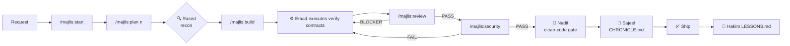

# 🏛️ MAJLIS — The Council
### Complete Usage Guide | v9.0

> **"One mind. Every tool."**
> A disciplined agent council: 40 real specialized agents + 90+ curated skills, installed with one command into any AI coding tool, enforcing a mandatory pipeline: plan → build → verify → security gate → chronicle — and it self-updates on every release.

---

## 1) What it actually is
Majlis is **not** an editor or a Claude Code/OpenCode replacement. It is a **discipline + team layer** you install *on top of* your favorite tool. In any tool you get:
- An agent team with fixed roles and least-privilege permissions
- A governing lifecycle that refuses to ship code without test evidence and a security verdict
- Institutional memory (`CHRONICLE.md`) and distilled lessons (`LESSONS.md`)

## 2) Install

| Method | Command |
|---|---|
| **npm (recommended)** | `npx majlis-council --all` |
| Single platform | `npx majlis-council --claude` (also `--codex` `--opencode` `--gemini` `--universal`) |
| Scaffold one project | `npx majlis-council --scaffold C:\path\project` |
| From source (Windows) | `powershell -File install_system.ps1` |

Then open any session in your tool — agents, commands and skills are live.

## 3) The Council of Forty

| Invoke | Agent | Role | Permissions |
|----------|--------|------|-------------|
| `@hadi-maestro` | 🎼 Maestro Hadi | Strategic planning & task routing | read + git |
| `@rased-explorer` | 🔍 Rased | 360° codebase recon before any work | read-only |
| `@emad-api-shield` | ⚙️ Emad | Backend build & API hardening | full |
| `@baher-qa` | 🎯 Baher | Quality gates: lint → typecheck → tests | run, no edits |
| `@sareem-security` | 🛡️ Sareem | Red gate: secrets/vulns, PASS/FAIL verdict | run, no edits |
| `@nadif-clean-code` | 🧼 Nadif | Final clean-code review (anti-sycophancy rubric) | read + git |
| `@bayan-diagrams` | 📈 Bayan | Mermaid architecture & flow diagrams | diagram writes |
| `@sajeel-logger` | 📝 Sajeel | Timestamped CHRONICLE.md audit trail | append-only |
| `@hakim-mentor` | 🧠 Hakim | Retrospectives into LESSONS.md | scoped edits |
| `@mubtakir-tools` | 🧰 Mubtakir | Search/evaluate/install tools & skills | full |
| `@balegh-docs` | 📣 Balegh | Bilingual EN/AR docs & release notes | docs writes |

> On platforms without subagents (Codex/Cursor/Gemini…), roles are available as `/prompts:majlis-*` commands or assumed per the role table in the master rules.


> **✦ Expansion (v9.2):** competitor-informed study added 13 specialists (`@product-shaper` `@ux-researcher` `@brand-guardian` `@growth-analyst` `@code-polisher` `@test-engineer` `@perf-auditor` `@a11y-auditor` `@release-manager` `@incident-detective` `@prompt-smith` `@context-steward` `@portfolio-steward`) — the Council is now **40/40** real.  
> **✦ Extended Council (v9.1):** all remaining members are now real agents too — the Council is **27/27** invocable on every platform: `@agent-weaver` · `@data-modeler` · `@stream-partitioner` · `@integrative-architect` · `@risk-assessor` · `@cinematic-director` · `@design-system-master` · `@responsive-layout` · `@print-publisher` · `@motion-coder` · `@cicd-automator` · `@sandbox-isolator` · `@dep-manager` · `@voice-engineer` · `@data-engineer` · `@hadi-core`


📖 **Full details:** [COUNCIL.md](COUNCIL.md) — all forty by division | [SKILLS_CATALOG.md](SKILLS_CATALOG.md) — every skill described

## 4) The Six Commands — Lifecycle

```
/majlis:start      Initialize: guided questions → PROJECT + ROADMAP + STATE
/majlis:plan <n>   Decompose phase into waves with mandatory verification contracts
/majlis:build      Execute waves in parallel through the proper council agents
/majlis:review     Review panel of 2-4 with anti-sycophancy rubrics (max 3 cycles)
/majlis:security   Red gate: secrets → config exposure → API defenses → verdict
/majlis:status     Progress dashboard + routes you to the exact next action
```

**Per-platform syntax:**

| Platform | Syntax |
|--------|--------|
| OpenCode | `/majlis-start` |
| Claude Code | `/majlis-start` (slash commands) |
| Codex | `/prompts:majlis-start` |
| Gemini CLI | `/majlis:start` |
| Cursor/Windsurf/Antigravity | Plain language: "run majlis start" |

## 5) Workflow Map



**Three golden rules:**
1. No task without a runnable verification command — the plan is rejected otherwise
2. Nothing ships with `SECURITY: FAIL`
3. No "should work" — evidence or silence

## 6) Skills (90+)
Deployed automatically in standard SKILL.md format to every platform:
- **Council roles** (~20): orchestration, security, qa, chronicle…
- **Security path**: trufflehog-secret-scanner, nuclei-security-auditor, owasp-zap-api-shield
- **Science databases** (~40): uniprot, pubmed, ensembl, gnomad…
- **Creative production**: remotion-video-engine, design-system-master-hsl…
- **Cloudflare** (13): workers, wrangler, durable-objects…

Invoke: OpenCode/Claude auto-discover via the skill tool · Codex via `$skill-name` · or read SKILL.md directly.

## 7) Self-Updating
- Edit the package → bump `VERSION.txt` → first OpenCode launch redeploys everywhere (~0.5s, silently)
- Log: `~/.config/opencode/.majlis_bootstrap.log`
- npm users: `npx majlis-council@latest --all`

## 8) Package Layout
```
majlis/
├── AGENTS.md            Governing constitution (read first)
├── VERSION.txt          Version (drives self-update)
├── install_system.ps1   Windows installer
├── deploy_skills.ps1    Skills-only deployer
├── agents/              40 agents (native OpenCode format)
├── commands/            6 majlis-*.md workflows
├── skills/              Skill source of truth (77 deployed)
├── templates/           Rule-pointer texts
├── plugins/             majlis-bootstrap.js (self-heal)
├── npm/                 Global distribution package (bin/install.js)
├── USAGE_AR/EN/ZH.md    Trilingual guides
└── _archive/            Historical archive
```

## 9) Troubleshooting
| Problem | Fix |
|---------|------|
| Agent missing from @ list | Ensure it exists in the platform's agents dir; reinstall |
| Skill not discovered | Name must match `[a-z0-9-]+` and equal its folder; rerun `--all` |
| Self-heal not firing | Check `.majlis_bootstrap.log` and `majlis_source.txt` exist |
| New/other editor | Use `--scaffold <project>` — rule pointers cover most tools |

---
**License:** MIT · **Identity:** Majlis Council · "Hunt first. Ship clean."
