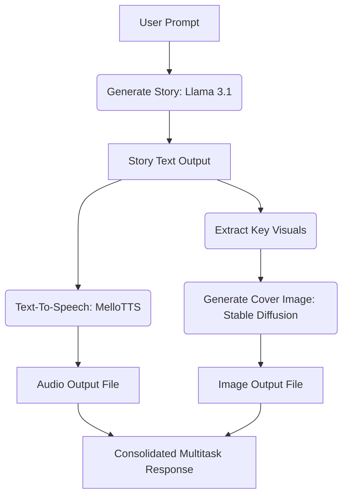

# Cloudflare AI Resources (موارد كلاودفلير AI)

This skill enables the AI assistant to interact with and build applications using **Cloudflare Workers AI** and **AI Gateway** effectively, remaining strictly within the **Free Tier** limits and utilizing optimal architecture for billing protection.

> [!IMPORTANT]
> **Reference Documentation URL:** [https://developers.cloudflare.com/](https://developers.cloudflare.com/workers-ai/)
> Use this URL exclusively as the official reference for any queries related to Cloudflare Workers AI, AI Gateway, or compatible models.

---

## 1. Free Tier Overview & Allocation (الخطة المجانية وحدودها)

Cloudflare offers a highly generous free tier for Workers AI that resets daily. 

* **Daily Allocation:** All Cloudflare accounts receive **10,000 neurons per day** for free.
* **Daily Reset:** The allocation resets daily at **00:00 UTC**.
* **Neurons Concept:** A "Neuron" is Cloudflare's unit of measurement for AI computing. Different tasks and models consume different amounts of neurons:
  * Smaller text models (e.g., Llama-3-8B) consume fewer neurons per token.
  * Larger models or image generation models consume more neurons per run.

---

## 2. Billing Protection & Cost Control (آليات الحماية والحد من الفواتير)

To ensure zero charges on your Cloudflare account, follow these absolute protection directives:

### A. Keep the Account on "Workers Free Plan"
If your account has no paid plan active (Workers Free Plan), Cloudflare will enforce a **Hard Limit**. Once the daily 10,000 neurons are exhausted, subsequent API requests will fail with an HTTP `429 Too Many Requests` error instead of charging you.

### B. Use Cloudflare AI Gateway
AI Gateway acts as a proxy sitting between your application and the AI models, providing control, analytics, and caching.
* **Enable Caching:** Enable caching in your AI Gateway dashboard. Identical requests will be served directly from the cache without hitting the models, saving your daily Neuron balance.
* **Configure Spend Limits (Gateway level):** If a credit card is attached to the account, configure **Spend Limits** inside AI Gateway.
  * Set a daily/weekly/monthly budget in dollars.
  * Set rules to automatically block requests if the budget is reached.
* **Set Account-Level Spend Limits:** Set an account-wide limit for loaded credits (Unified Billing) as a final backstop.

---

## 3. Direct Instructions & Integration Methods (تعليمات وطرق الاستخدام المباشر)

You can call Cloudflare Workers AI via three primary methods:

### Method A: REST API (External Applications)
* **Base URL:** `https://api.cloudflare.com/client/v4/accounts/{ACCOUNT_ID}/ai/run/`
* **Authentication Header:** `Authorization: Bearer {API_TOKEN}`
* **Content-Type:** `application/json`

### Method B: Cloudflare Workers (Serverless Bindings)
When developing inside a Cloudflare Worker:
```javascript
// wrangler.toml
[ai]
binding = "AI"

// index.js (Worker)
export default {
  async fetch(request, env) {
    const response = await env.AI.run('@cf/meta/llama-3.1-8b-instruct', {
      prompt: "Hello World"
    });
    return new Response(JSON.stringify(response));
  }
}
```

---

## 4. Multitask AI Orchestration Templates (نماذج بناء أدوات ذكاء اصطناعي متعددة المهام)

Here are the optimal boilerplate templates for generating Text, Images, and Audio.

### A. Text Generation (Llama 3.1)
* **Model ID:** `@cf/meta/llama-3.1-8b-instruct`

#### Node.js / JavaScript
```javascript
async function generateText(accountId, apiToken, promptText) {
  const response = await fetch(
    `https://api.cloudflare.com/client/v4/accounts/${accountId}/ai/run/@cf/meta/llama-3.1-8b-instruct`,
    {
      method: "POST",
      headers: {
        "Authorization": `Bearer ${apiToken}`,
        "Content-Type": "application/json"
      },
      body: JSON.stringify({
        messages: [
          { role: "user", content: promptText }
        ]
      })
    }
  );
  const data = await response.json();
  return data.result.response;
}
```

---

### B. Image Generation (Stable Diffusion XL)
* **Model ID:** `@cf/stabilityai/stable-diffusion-xl-base-1.0`

#### Node.js / JavaScript
```javascript
async function generateImage(accountId, apiToken, imagePrompt) {
  const response = await fetch(
    `https://api.cloudflare.com/client/v4/accounts/${accountId}/ai/run/@cf/stabilityai/stable-diffusion-xl-base-1.0`,
    {
      method: "POST",
      headers: {
        "Authorization": `Bearer ${apiToken}`,
        "Content-Type": "application/json"
      },
      body: JSON.stringify({ prompt: imagePrompt })
    }
  );
  // Returns raw binary image data (PNG/JPEG)
  const imageBuffer = await response.arrayBuffer();
  return imageBuffer;
}
```

---

### C. Text-To-Speech (MelloTTS / Deepgram Aura)
* **Model ID:** `@cf/myshell-ai/melotts` or `@cf/deepgram/aura-1` (if integrated)

#### Python Template
```python
import requests

def text_to_speech(account_id, api_token, text):
    url = f"https://api.cloudflare.com/client/v4/accounts/{account_id}/ai/run/@cf/myshell-ai/melotts"
    headers = {
        "Authorization": f"Bearer {api_token}",
        "Content-Type": "application/json"
    }
    payload = {
        "text": text,
        "lang": "en"  # or direct language code supported
    }
    response = requests.post(url, headers=headers, json=payload)
    if response.status_code == 200:
        # Returns binary audio file (typically wav/mp3)
        return response.content
    else:
        raise Exception(f"Failed to generate speech: {response.text}")
```

---

### D. Audio-to-Text (Transcription: Whisper)
* **Model ID:** `@cf/openai/whisper`

#### cURL
```bash
curl https://api.cloudflare.com/client/v4/accounts/{ACCOUNT_ID}/ai/run/@cf/openai/whisper \
  -X POST \
  -H "Authorization: Bearer {API_TOKEN}" \
  --data-binary "@audio.mp3"
```

---

## 5. Sequential Multitask Workflow (سير العمل المتتابع متعدد المهام)

For orchestrating a pipeline where a prompt generates a story, makes an image for the story, and reads the story aloud:



To run this pipeline efficiently under the free tier:
1. **Pass the prompt** to Llama 3.1 to get the narrative.
2. **Summarize** or construct a visual prompt from the story.
3. **Trigger Stable Diffusion** for the image.
4. **Trigger MelloTTS** with the narrative to get the audio.
5. Utilize **AI Gateway Caching** on all prompts to ensure that running the pipeline repeatedly during development does not drain the 10,000 daily neuron limit.
