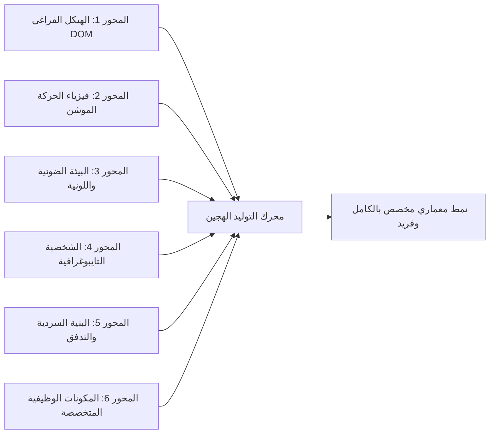

# 🏛️ السجل التراكمي الحي لخزانة الأنماط المعمارية (The Living Style Vault)

> **دستور التحديث التراكمي المستمر والمحاور المتغيرة:**  
> يُحظر في المجلس حصر التصاميم في قوالب ثابتة أو معلبة مسبقاً. الأنماط المعمارية في المجلس هي **توليدات تركيبية ديناميكية** ناتجة عن تقاطع محاور هندسية متغيرة، مع الالتزام التام بـ **الأصالة التخصصية ومنع تدوير القوالب (Rule 14)**؛ فكل قطاع يمتلك أنماطه وأدواته النابعة من طبيعة عمله.

---

## 🎛️ مصفوفة المحاور التوليدية المتغيرة (The Generative Axes Matrix)

---

## 📚 السجل المعتمد لأنماط المنتجات الفاخرة والعضوية (Luxury & Provenance Registry)
*(مطبقة في مشروع showroom_project)*
- **[ARCH-01]** التراث الملكي النخبوي (Royal Heritage Editorial)
- **[ARCH-02]** شبكات البنتو الكفاءاتية الذكية (Kinetic Bento Grid Matrix)
- **[ARCH-03]** المسرح السينمائي 3D التفاعلي (True 3D WebGL Canvas Stage)
- **[ARCH-04]** المينيمالي السويسري الصريح (Pure Swiss Architectural Minimal)
- **[ARCH-05]** الطبيعة العضوية الحية (Raw Earth Botanics & Fluid Wave)
- **[ARCH-06]** الخزينة الليلية والزجاج المدخن (Obsidian Vault Luxury)
- **[ARCH-07]** الأزرار اللمسية الناعمة (Soft Tactile Neumorphic Deck)
- **[ARCH-08]** المجلة التحريرية الفنية (Editorial Artistic Collage)
- **[ARCH-09]** المختبر الطيفي العلمي (Clinical Biotech Laboratory HUD)
- **[ARCH-10]** الورشة الحرفية والطباعة الخشبية (Artisan Woodcut Craft)

---

## ⚡ السجل المعتمد لأنماط الأكاديميات والمنصات التقنية (Tech & CS Academy Registry)
*(مطبقة في مشروع tech_academy_project - خالية 100% من التكرار وبأدوات وظيفية حصرية)*

| الكود | اسم النمط | المرجع العالمي | الأداة التفاعلية الحصرية | الشخصية المعمارية واللونية |
|---|---|---|---|---|
| **ARCH-TECH-01** | التيرمينال السيبراني والدفاع المنخفض | *DEFCON / OverTheWire* | **تيرمينال CLI حي** ينفذ أوامر واقعية بالمتصفح | Monospace Terminal Slate & Cyan |
| **ARCH-TECH-02** | حلبة الخوارزميات ومحلل التعقيد الحسابي | *NeetCode / AlgoExpert* | **محاكي بصري لخطوات الفرز والبحث** مع Big-O | Algorithm Stepper Canvas & Matrix Amber |
| **ARCH-TECH-03** | أكاديمية المهام والألعاب وشجرة المهارات | *42 School / 01Edu* | **شجرة مهارات تفاعلية RPG** لفتح المستويات و XP | Constellation Gamified Matrix |
| **ARCH-TECH-04** | الماستركلاس السينمائي ودفتر الشفرة | *Frontend Masters / Egghead* | **مشغل درس فيديو متزامن** مع تبديل الكود المباشر | Cinema Player & Studio Dark |
| **ARCH-TECH-05** | زمالة المصادر المفتوحة وسجل المساهمات | *Recurse Center / MLH* | **بث حي لمساهمات Git والـ Pull Requests** | Monorepo Stream & Clean Slate |
| **ARCH-TECH-06** | مختبر أبحاث الذكاء الاصطناعي وحلبة النماذج | *PapersWithCode / LMSYS* | **لوحة تصنيف وتصويت ELO للنماذج** مع MMLU | Model Arena Matrix & Indigo |
| **ARCH-TECH-07** | معمل البوابات المنطقية والدوائر التفاعلي | *Brilliant / Nand2Tetris* | **بوابات منطقية تفاعلية AND/OR/XOR** مع جدول الحقيقة | Interactive Logic Gates Playground |
| **ARCH-TECH-08** | مسرعة التوظيف وحاسبة تقاسم الدخل (ISA) | *BloomTech / Lambda* | **حاسبة تفاعلية لعقد تقاسم الدخل** وشريط الرواتب | Career Accelerator & Financial Trust |
| **ARCH-TECH-09** | معمل الدفاتر البرمجية وتدريب الشبكات | *Fast.ai / Kaggle* | **دفتر Jupyter تفاعلي** مع Run Cell و Loss Curves | Notebook Code Execution Cells |
| **ARCH-TECH-10** | مسرح الحوسبة المكانية والكمية 3D | *Apple Academy / Qiskit* | **مسرح WebGL Three.js 3D** لنواة كمية تدور 360° | 3D Spatial Hologram Stage |
